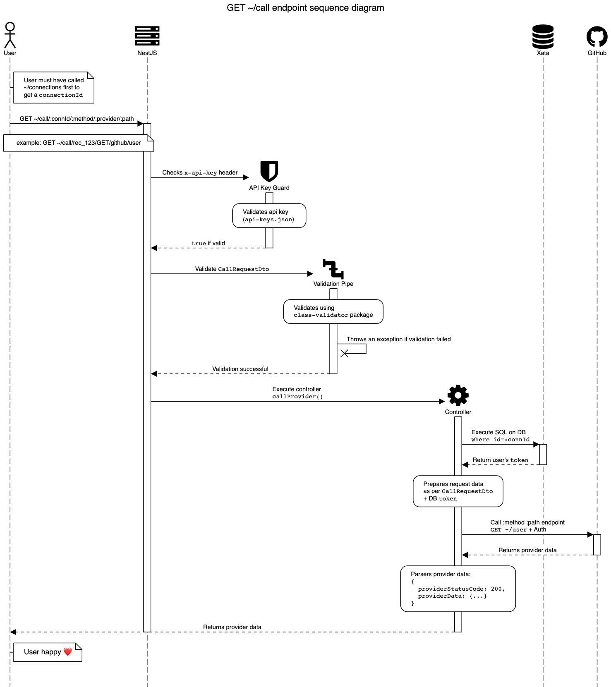

```
 ____  _ _                                 _   _
| __ )| (_)___ ___  __ _ _ __ _____      _| |_| |__
|  _ \| | / __/ __|/ _` | '__/ _ \ \ /\ / / __| '_ \
| |_) | | \__ \__ \ (_| | | | (_) \ V  V /| |_| | | |
|____/|_|_|___/___/\__, |_|  \___/ \_/\_/  \__|_| |_|
                   |___/
```

[GitHub Project board](https://github.com/users/bettiolo/projects/1)

> FictionalAPI wants to build an API connection repository/manager. A service that allows developers to submit credentials for an integration, and then use the service to call the underlying integration. The vision is that the service would handle credentials life-cycle management, data transformations, end-user integration management and so on. Owning all parts of the API/Integrations management.


## Best Practices

- [Follow TDD practices](https://womanonrails.com/tdd-30devstories)
- [Follow TypeScript best practices](https://climbtheladder.com/10-typescript-best-practices/) 
- [Keep up-to-date the Kanban board](https://github.com/users/bettiolo/projects/1)
- **TODO:** Git commit hooks (ie `husky`), let's make sure we push good code
- **TODO:** Internal UI to test the endpoints
- **TODO:** [Use Conventional Commits syntax](https://www.conventionalcommits.org/en/v1.0.0/)
- **TODO:** Connections' token data should be encrypted at rest. Currently, data is stored as plaintext and is not secure!
- **TODO:** Document API endpoints using [OpenAPI](https://swagger.io/specification/)

## Architecture

[Source](docs/architecture.txt)

## Setup

This project is built using [Nest](https://github.com/nestjs/nest) framework.

Learn about NestJS:

- https://youtu.be/0M8AYU_hPas
- https://youtu.be/4ZW9LQvUs9k
- https://youtu.be/C250DCwS81Q

## Installation

Tools used:
- `.nvmrc` with `fnm` for consistent nodejs versioning
- `editorconfig` for consistent editor settings
- `prettier` for standardised code (auto)formatting
- `eslint` to find code issues
- `nesjs` for the API framework
- `jest` for testing
- `xata` for the database + typed db client
- `insomnia` to manually test the API endpoints

```bash
$ npm install
```

## Running the app

```bash
# watch mode
$ npm run start:dev

# production mode
$ npm run start:prod
```

To access the app visit [localhost:3000](http://localhost:3000) on your browser

## Test

```bash
# unit tests
$ npm run test

# e2e tests
$ npm run test:e2e

# test coverage
$ npm run test:cov
```

## License

This exercise is licensed under [Attribution-NonCommercial-ShareAlike 4.0 International](LICENSE). The code cannot used for commercial purposes.
